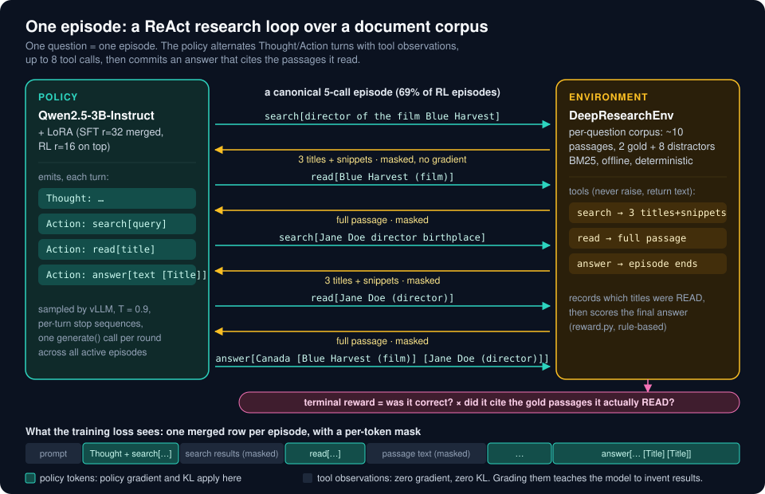
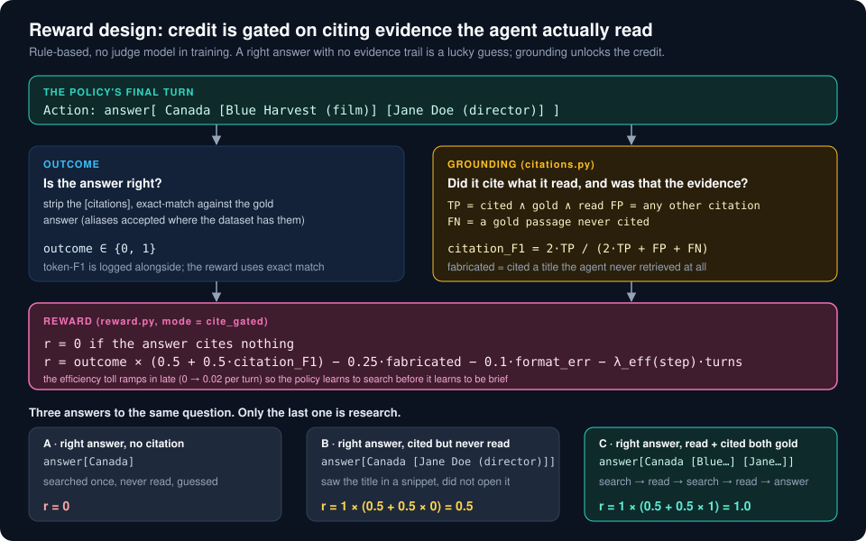
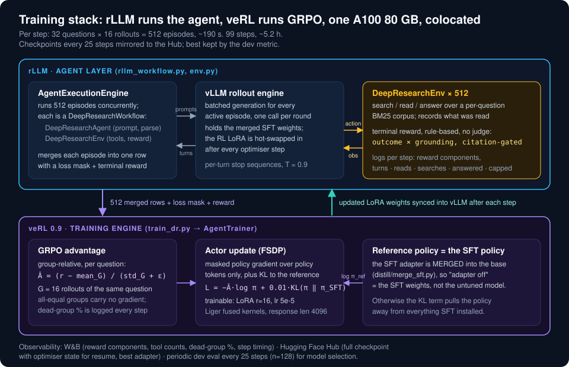

# CiteSearch-RL

**Training a 3B open-weight model to do agentic RAG: search, read, and cite its sources, with reinforcement learning.**

[](LICENSE)


A production-style pipeline that teaches `Qwen2.5-3B-Instruct` to run a multi-turn ReAct
research loop over a document corpus: issue a search, read the passages it found, search
again, and commit to an answer that **cites only passages it actually read**. The policy is
trained in two stages, teacher distillation from `gpt-4.1-mini` acting inside the real
environment, then GRPO with [rLLM](https://github.com/rllm-org/rllm) and
[veRL](https://github.com/volcengine/verl) on a single A100, and evaluated on held-out and
out-of-distribution question sets with paired bootstrap confidence intervals.

---

## Why

Hosted "deep research" products run every turn of the research loop through a frontier API.
At high request volume that is the dominant cost. This project tests the alternative: can a
small open-weight model be *trained* to do the same multi-turn tool-calling loop, well enough
to be worth serving? Document search stands in for web search and passage reads stand in for
page fetches, so the whole loop runs offline and every result is reproducible.

The hard part is not getting the model to answer. It is getting it to answer **only after
retrieving the evidence**, and to say which evidence. That is what the reward is built around.

## Results

Three question sets, all greedy decoding, all frozen before any training decision was made.
`heldout_eval` (n=300) draws from the HotpotQA and 2WikiMultiHopQA validation splits.
`musique_dev` (n=300) is MuSiQue, a third dataset the model never saw, harder by construction
(2 to 4 hops composed to defeat shortcuts).

**Stage 1, SFT.** A citation only scores if the agent `read` that passage and the passage is
in the question's gold supporting set ("cite what you read"). Before training, that never
happened.

| held-out, n=300 | base model | base + worked example in prompt | **SFT (LoRA r=32)** |
|---|---|---|---|
| correct (exact match) | 0.030 | 0.193 | **0.417** |
| picked the right sources | 0.007 | 0.291 | **0.744** |
| read before citing | 0.003 | 0.198 | **0.810** |
| citation F1 | 0.002 | 0.110 | **0.710** |
| never used a tool | 0.897 | 0.107 | **0.000** |
| **correct AND properly cited** | **0.0%** | **0.3%** | **30.7%** |

The middle column is the control most write-ups skip: most of the raw *correctness* gain is
available from prompting alone. What SFT adds that prompting cannot is the process, reading
before citing, which goes from 0.198 to 0.810. Excluding the 16% of episodes that hit the
turn cap without answering, the tuned model is 0.482 correct with 0.817 citation F1.

**Stage 2, GRPO from the SFT policy.** Starting from a stronger SFT adapter trained on 1,209
correct-and-fully-cited teacher episodes, 99 GRPO steps at 512 trajectories per step with a
KL term to the SFT reference. Paired deltas, 95% bootstrap CI.

| | SFT | **SFT + RL (step 75)** | Δ, 95% CI |
|---|---|---|---|
| **dev, n=128** correct and properly cited | 0.484 | **0.570** | +8.6 |
| **held-out, n=300** correct | 0.517 | 0.520 | +0.3 [−4.7, +5.0] |
| held-out, correct and properly cited | 0.380 | 0.393 | +1.3 [−2.7, +5.3] |
| held-out, read before citing | 0.860 | **0.895** | +3.5 |
| held-out, episodes that hit the turn cap | 0.117 | **0.097** | −17% relative |
| **MuSiQue (OOD), n=300** correct | 0.220 | **0.260** | **+4.0 [+0.3, +7.7]** |
| MuSiQue, hit the turn cap | 0.530 | **0.443** | **−8.7 [−14.3, −3.0]** |
| MuSiQue, read before citing | 0.465 | **0.585** | +12.0 |
| MuSiQue, reads / searches per episode | 2.18 / 3.97 | 2.85 / 3.14 | reads up, searches down, turns flat |

**Honest reading.** The dev-set gain did not replicate at that size on the in-distribution
held-out set, where the change is inside the noise. What did transfer is the *process*: the
RL policy reads what it finds instead of re-searching, cites what it read more often, and
gets stuck far less. On the out-of-distribution set, where one search is rarely enough, that
process change turns into a significant correctness gain concentrated on 3- and 4-hop
questions (4-hop: 0.049 → 0.131 correct). No length, citation, or turn inflation on any set.

Every number above is in a committed per-episode JSON under `distill/` (see *Artifacts*).

## How it works

<p align="center"></p>

```
                 ┌─────────────────────────────────────────────────────────┐
                 │  DeepResearchEnv  (env.py)                              │
   question ───▶ │  per-question corpus: ~10 passages, BM25 (corpus.py)    │
                 │  tools: search[q] · read[title] · answer[text [Title]]  │
                 │  reward: outcome × grounding, gated on citations        │
                 └───────────────┬─────────────────────────────────────────┘
                                 │ trajectories
     ┌───────────────────────────┼────────────────────────────────┐
     ▼                           ▼                                ▼
 gpt-4.1-mini as the policy   masked multi-turn SFT          GRPO (rLLM + veRL)
 inside the SAME env          LoRA r=32, plain torch loop    LoRA r=16 on the merged SFT
 4,000 episodes, $8.88        only assistant turns graded    weights, KL to SFT reference
 (distill/teacher.py)         (distill/sft_train.py)         (train_dr.py, rllm_workflow.py)
     │                           │                                │
     └────────── evaluate: 3 arms, 3 splits, vLLM batched, LoRA hot-swap ──────────┘
                 (distill/eval_sft.py · distill/eval_rl.py · evaluate.py)
```

**Environment.** HotpotQA and 2WikiMultiHopQA ship roughly ten paragraphs per question, two
gold and eight distractors. That per-question set is the corpus, retrieved with a
dependency-free BM25. It makes every episode deterministic and offline, and the gold
supporting titles give a free retrieval metric. The same design absorbs a new dataset as a
new loader and nothing else, which is how MuSiQue was added in one afternoon.

**Reward.** Rule-based, no judge model in the training loop:

```
r = 0                                             if the answer cites nothing
r = correct × (floor + (1 − floor) × citation_F1)  otherwise
    − w_fab × fabricated_citations − λ_fmt × format_errors − λ_eff(step) × turns
```

`citation_F1` counts a cited title as a true positive only if it is gold **and** the agent
called `read` on it. A right answer with no evidence trail earns the floor, not full credit.
Fabricated citations (titles never retrieved) are penalised separately because they are the
sharpest tool-call-hacking signal. The efficiency toll ramps in late so the policy learns to
search before it learns to be brief.

<p align="center"></p>

**Teacher distillation, done the safe way.** The teacher is not asked to *write*
trajectories. It is dropped in as the policy of the same environment: it picks the action, the
corpus answers, the environment does the bookkeeping. Every observation is real and every
teacher trajectory is graded by the same code that grades the student. A non-reasoning teacher
was chosen deliberately, so that a 3B student is not trained to start reasoning chains it
cannot finish.

**Data hygiene.** `splits.py` is the single source of truth for which questions belong to
which stage (`heldout_eval` · `sft_collect` · `sft_dev` · `rl_train` · `musique_dev`), pinned
to one draw and asserted disjoint. Teacher collection was verified to sit 100% inside its
split with zero leakage into the RL pool or the held-out set.

**RL details that mattered.** The SFT adapter is merged into the base weights before GRPO so
that veRL's KL reference is the SFT policy rather than the untuned model. veRL's
`max_response_length` bounds the *merged* multi-turn response, not one turn; sizing it per
turn silently truncated 30 to 40% of trajectories and zeroed their reward in every early run
(finding F18). Rollouts use per-turn stop sequences, and turns, reads, searches and answered
rate are logged per step so a collapse toward answer-immediately is visible within 20 steps.

<p align="center"></p>

## Engineering

- **93 offline tests** across `tests/`, `distill/tests/`, `rft_diagnosis/tests/`. The
  environment, reward, citation verifier, masking and evaluation gate all run with no GPU
  and no framework installed. The masking is asserted per example against the real tokenizer.
- **Batched evaluation** drives every held-out episode concurrently through one vLLM engine,
  base and tuned sharing the same resident weights via LoRA hot-swap. A 300-question,
  three-arm eval is minutes, not hours.
- **A pinned, reproducible stack.** `setup_pod.sh` installs `rllm` at a commit SHA with
  `verl==0.9.0`, `torch==2.11.0`, `vllm==0.22.1`, `flash-attn==2.8.3`, and documents each of
  the six installability bugs it works around. `pip-freeze.txt` is the resolved matrix.
- **Checkpoint and resume mirrored to the Hub**, best-checkpoint tracking by held-out metric,
  W&B dashboards with per-component reward breakdowns and a dead-group roll-up.
- **A findings register** (`docs/START_HERE.md`): 24 numbered findings, each marked
  CONFIRMED, KILLED or OPEN, with the file that holds the evidence. Includes the eight bugs
  found in the native tool-calling harness by reading raw model output, and the hypotheses
  that were formed and then disproved by data.

## Repository layout

```
citesearch-rl/
├── README.md                 this file
├── config.py                 one dataclass; presets: sanity · cloud · rl_from_sft · probes
├── corpus.py  tools.py       DocStore + BM25 retriever; search / read / answer
├── data.py    splits.py      HotpotQA · 2Wiki · MuSiQue loaders; the frozen stage splits
├── trajectory.py metrics.py  trajectory types with per-token masks; EM / F1 / hit-rate
├── citations.py              citation extraction + verification (gold / overlap / NLI backends)
├── reward.py                 the layered, citation-gated reward
├── env.py                    DeepResearchEnv: the rLLM environment wrapping all of the above
├── rllm_workflow.py          the rLLM Workflow / BaseAgent port + W&B metric injection
├── train_dr.py               GRPO entry point (rLLM AgentTrainer → veRL)
├── evaluate.py  judge.py     framework-agnostic eval gate; optional LLM judge as a probe
├── hub.py                    checkpoint merge + Hub mirror, best-checkpoint tracking
├── distill/                  the SFT stage
│   ├── teacher.py collect.py validate.py     teacher-as-policy collection + grounding checks
│   ├── sft_data.py build_sft.py sft_train.py masked multi-turn dataset + LoRA trainer
│   ├── merge_sft.py push_sft.py              merge the adapter for the RL reference; publish
│   ├── eval_sft.py eval_rl.py               three-arm and SFT-vs-RL evaluation, vLLM batched
│   ├── eval_*.json  run_histories/          per-episode eval rows and training curves
│   └── RESULTS.md  *_LOG.md                 the SFT-stage write-ups
├── rft_diagnosis/            the capability diagnosis + harness audit (transcripts included)
├── tests/                    45 offline tests for the core
├── scripts/                  throughput probes
├── setup_pod.sh launch_cloud.sh  one-shot pod bootstrap; tmux launcher
├── requirements.txt pip-freeze.txt
└── docs/                     the engineering log (see docs/README.md)
```

## Reproduce

**Offline, no GPU (a few seconds):**

```bash
python -m venv .venv && source .venv/bin/activate
pip install pytest "datasets>=2.19" python-dotenv transformers    # transformers: tokenizer for the masking tests
python -m pytest -q tests/ distill/tests/ rft_diagnosis/tests/
python -c "import data; data.selfcheck()"       # BM25 surfaces the gold passages on the fixture
python train_dr.py --dry-run cloud               # resolves the config and the veRL overrides
```

**On a single A100 80 GB:**

```bash
bash setup_pod.sh                                # pinned rLLM + veRL + vLLM stack, ~15 min
source .venv-deep-research/bin/activate
python train_dr.py sanity                        # one real GRPO step on the 0.5B stand-in

# Stage 1: teacher data → SFT   (needs OPENAI_API_KEY in .env; ~$9 for the full split)
python distill/collect.py --batch 50 --max-cost 1.00
python distill/validate.py
python distill/build_sft.py --tiers A --out distill/sft_dataset_A.pt
python distill/sft_train.py --dataset distill/sft_dataset_A.pt --run-name sft_A
python distill/eval_sft.py --adapter distill/runs/sft_A/final --split heldout_eval --n 300

# Stage 2: GRPO from the SFT policy
python distill/merge_sft.py --adapter distill/runs/sft_A/final     # the KL reference
python train_dr.py rl_from_sft                                       # ~5 h for 100 steps
bash distill/run_rl_eval.sh <train-pid>                              # dev → held-out → MuSiQue
```

`distill/run_sft_ab.sh` runs the whole pre-RL chain unattended. Every command's
exact behaviour, expected output and known failure modes are in `docs/HANDOFF.md`.

## Artifacts

| what | where |
|---|---|
| SFT eval rows, three arms, dev and held-out | `distill/eval_sft_A_dev.json`, `distill/eval_sft_A_heldout.json` |
| SFT A/B (correct-only vs imitate-all) | `distill/eval_sft_correct_only_dev.json`, `distill/eval_sft_imitate_all_dev.json` |
| RL eval rows: dev, held-out, MuSiQue | `distill/eval_rl_sft_dev.json`, `distill/eval_rl_heldout.json`, `distill/eval_rl_musique_dev.json` |
| SFT training curves | `distill/run_histories/*.json` |
| Teacher pilot + real transcripts | `distill/teacher_pilot*.json`, `distill/transcripts/`, `rft_diagnosis/transcripts/` |
| Trained adapters and the 4,000-trajectory teacher dataset | Hugging Face Hub, `harpreet22happy/deep-research-agent-*` (release pending) |
| Training dashboards | Weights & Biases, project `deep_research_agent` (run `t2n91x71`) |

## Stack

`Qwen/Qwen2.5-3B-Instruct` · LoRA via peft · rLLM `@9beb6e0` · veRL 0.9.0 · vLLM 0.22.1 ·
torch 2.11.0 (cu128) · flash-attn 2.8.3 · transformers 5.5.4 · datasets 5.0.1 · W&B ·
`gpt-4.1-mini` as the distillation teacher. Data: HotpotQA (distractor), 2WikiMultiHopQA,
MuSiQue.

## Status and next steps

The pipeline is complete end to end and has been run once at full scale. The cheapest
experiments queued, in order: train RL on the hard-question slice (the held-out HotpotQA is
100% hard-level, the training pool is 18%), an SFT recipe that keeps commitment without
losing citation completeness, and a longer or 2-GPU run. Details in `docs/HANDOFF.md`.

## License

MIT. See [LICENSE](LICENSE).
